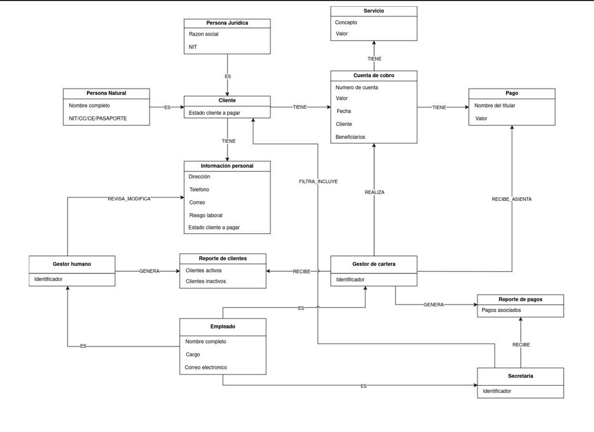
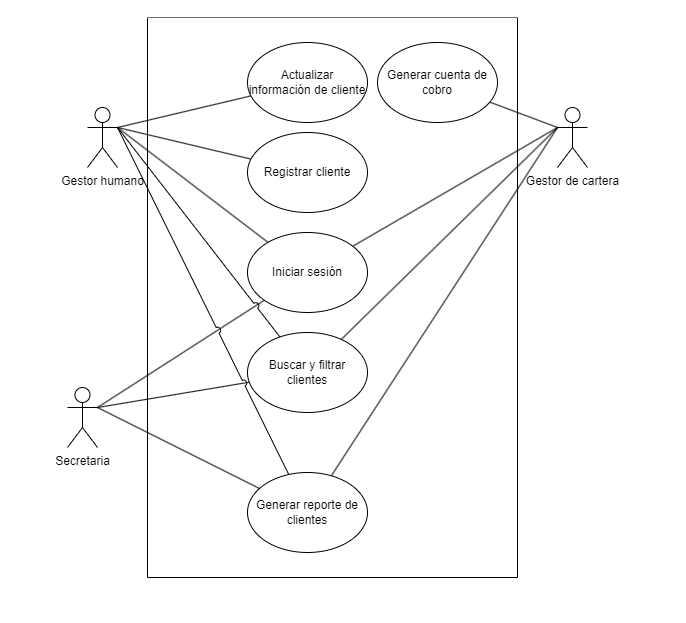
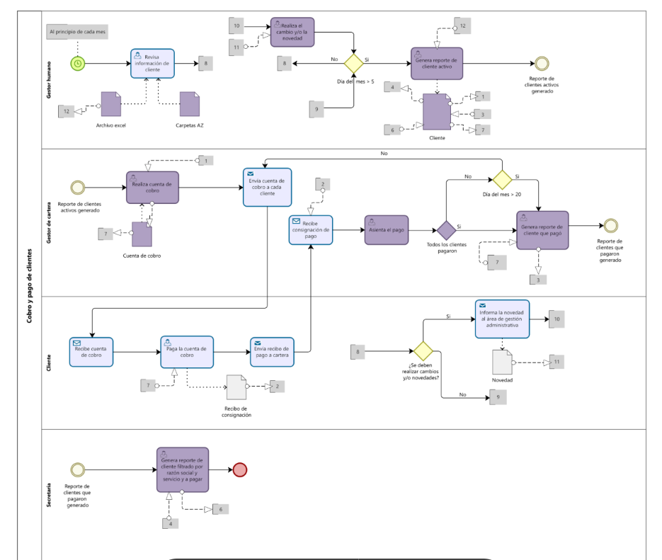

# IE Prestadora de servicios

Aplicación de manejo de clientes, servicios y cuentas de cobro para dichos servicios. Cuenta con generación de reportes y operaciones CRUD para las entidades de dominio.

## Diseño

La aplicación usa DDD y arquitectura hexagonal, usa Effect como sistema de efectos funcionales y aprovecha su implementación del monada Reader para realizar la inyección de dependencias, está pensada para usar Supabase como backend

### Diagrama de modelo

### Diagrama de casos de uso

### Diagrama de procesos relacionado

## Estructura

- /application -> Capa de aplicación, responsable de los mecanismos de IoC
- /components -> Componentes
- /domain -> Gateways, modelo y use cases
- /driven-adapters -> Driven-adapters (Supabase y spreadsheet)
- /routes -> Vistas
